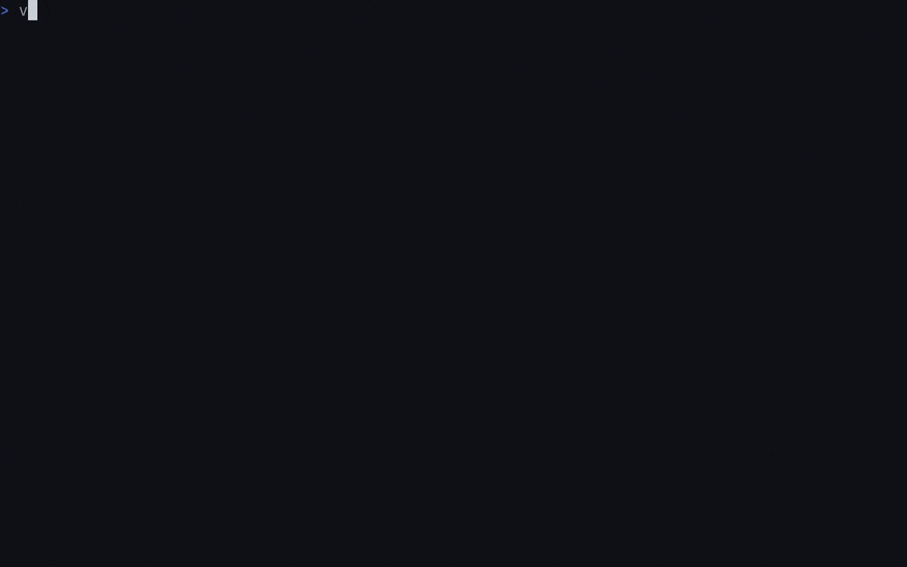

<h1 align="center">vev</h1>

<p align="center">
  <a href="LICENSE"></a>
  <a href="https://github.com/bnema/vev/releases"></a>
  <a href="https://github.com/bnema/vev/commits/main"></a>
  <a href="https://github.com/bnema/vev/stargazers"></a>
</p>

<p align="center"><em>Norwegian: to weave</em></p>

<p align="center">A minimal, remote friendly terminal multiplexer for Linux and macOS.</p>

<p align="center"></p>

---

## Install

```sh
curl -fsSL https://raw.githubusercontent.com/bnema/vev/main/install.sh | sh
# Arch Linux: yay -S vev-bin
# or: go install github.com/bnema/vev@latest
```

Releases support Linux x86_64/arm64 and macOS Apple silicon.

## Usage

```text
vev                              create an ephemeral session
vev new <name>                   create a named session
vev attach <name>                attach to a local session (alias: a)
vev attach user@host[:session]   attach to a remote daemon
vev ls [<host>|--all]            list sessions
vev host add|rm <host>           manage remote hosts
vev host list                    list remote hosts
vev kill <name>|--all            kill sessions
```

The daemon starts on first use and exits after the last session. Numbered sessions survive detach; named sessions also survive daemon restarts. See [durable-session recovery](docs/durable-session-recovery.md).

> [!NOTE]
> A release that bumps vev's protocol version resets named sessions saved by an older protocol. Session names are retained, but layouts, tabs, terminal history, recovery transcripts, and process-recovery state are discarded. Each local or remote daemon applies this reset to its own sessions when it first starts with the new protocol.

## Keys and palette

No prefix key; bindings use Alt.

| Key | Action |
|---|---|
| Alt+Space | command palette |
| Alt+f | floating terminal |
| Alt+1 … 9 | switch tab |
| Alt+h/j/k/l or Alt+Arrow | focus pane |
| Alt+a | jump to a session needing attention |

Type a code or fuzzy-search the palette. Common default codes:

| Code | Action | Code | Action |
|---|---|---|---|
| `CNT` | new tab | `CNS` | new named session |
| `SPR` / `SPL` | split right / left | `SPU` / `SPD` | split up / down |
| `STP` / `TFS` | stack / toggle stack | `TFP` | floating terminal |
| `MFP` / `MAT` | move pane / tab | `SSP` | session picker |
| `DET` | detach | `NTC` | notifications |

Scroll up to enter copy mode; use vim motions, `v` to select, and `y` to copy. All codes and bindings are configurable in [configuration](docs/configuration.md).

## Remote attach

```sh
vev attach user@host[:session]
```

SSH bootstraps an authenticated direct UDP connection that resumes after sleep or network changes. Set `VEV_REMOTE_TRANSPORT=stdio` to use SSH only. The remote host needs vev installed; see [remote resilience](docs/remote-resilience.md) for firewall, transport, and host-list details.

## Scripting

`vev cmd` controls a running daemon without starting one:

```sh
vev cmd split-right
vev cmd toast -l warn "build failed"
vev cmd list-panes --json
```

Use `vev cmd --help` for commands and targeting options.

## Documentation

- [Configuration](docs/configuration.md): bindings, palette, theme, overlays, and bar anchors
- [Terminal compatibility](docs/terminal.md)
- [Remote resilience](docs/remote-resilience.md)
- [Durable session recovery](docs/durable-session-recovery.md)
- [Performance](docs/performance.md)

## Development

```sh
make test   # go test ./... -race
make lint   # goimports check, go vet
make mocks  # regenerate mocks
make demo   # regenerate docs/assets/demo.gif (needs Docker)
```
